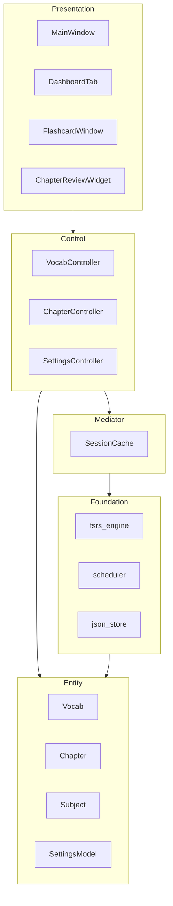

# 習習複習習


A macOS desktop app for spaced-repetition vocabulary review and chapter study, built with PyQt6.

- **Vocabulary**: FSRS v6.3.1 algorithm — Again / Hard / Good / Easy scheduling up to 365 days
- **Chapter review**: SM-2 algorithm — random question draw with 30-minute countdown timer
- **Dark luxury theme**: consistent ACCENT_GOLD design across all screens
- **Data stored locally**: `~/Library/Application Support/習習複習習/data/`

---

## Architecture



---

## Installation

```bash
git clone https://github.com/LeeChiChun/studytracker.git
cd studytracker
python -m venv venv
source venv/bin/activate
pip install -r requirements.txt
python main.py
```

## Build macOS App

```bash
pyinstaller --windowed --onedir \
  --name "習習複習習" \
  --icon assets/icon.icns \
  main.py
```

---

## Author

李集雋 (Lee Chichun) — [GitHub](https://github.com/LeeChiChun)
